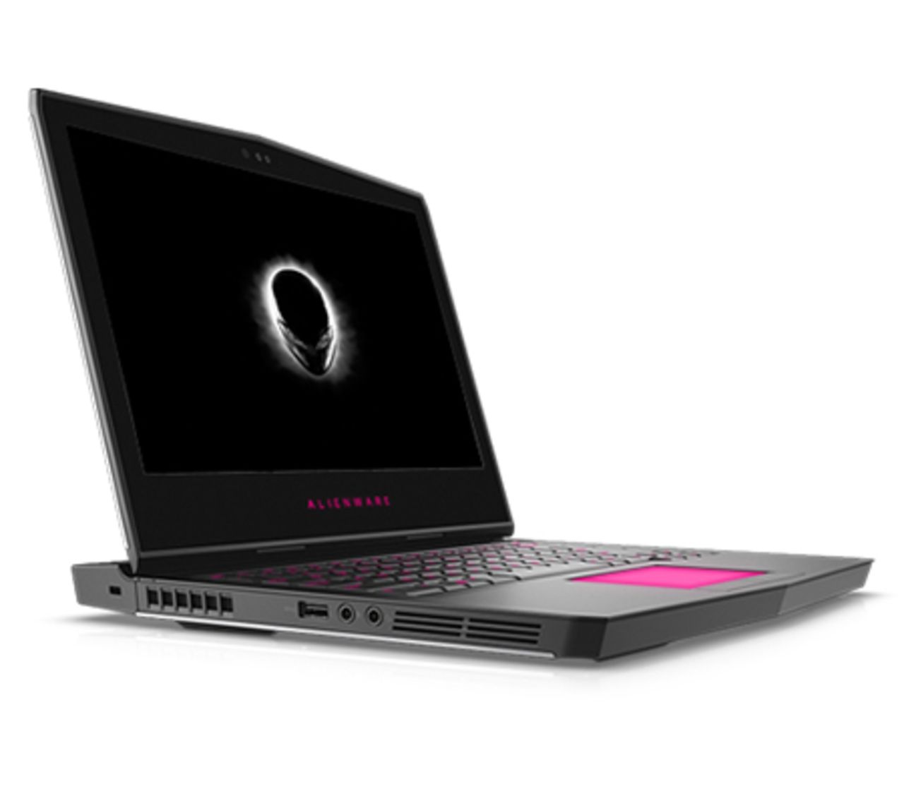

device list
===========

| # | DEVICENAME (as in BIOS)  | CONTROLLER-FILE  | RELEASE DATE  | DEVICETYPE  | SUPPORTSTATE  | ALIENFX-CONTROLLER HW-ID  | BITS PER COLOR  | PICTURE  |
| -------------:| -------------:| -------------:| -----:|-----:|-----:|-----:|-----:|-----:|
| 1 | ? | controller_17r3.py |  | Laptop | Needs the correct Zone Codes | 0x0528 | 4 |  |
| 2 | ? | controller_area51.py |  | Desktop | Unknown | 0x0511 | 4 |  |
| 3 | ? | controller_aurora.py |  | Desktop | support by [Bill Ochetski](https://github.com/ochetski) | 0x0513 | 4 |  |
| 4 | ? | controller_m11xr1.py |  | Laptop | Needs the correct Zone Codes | 0x0514 | 4 |  |
| 5 | ? | controller_m11xr2.py |  | Laptop | Needs the correct Zone Codes | 0x0515 | 4 |  |
| 6 | ? | controller_m11xr3.py |  | Laptop | Needs the correct Zone Codes | 0x0522 | 4 |  |
| 7 | ? | controller_m13xr2.py |  | Laptop | support by [Simon Wood](https://github.com/mungewell) | 0x0527 | 4 |  |
| 8 | Alienware 13 R3 | controller_13r3.py | Q1/2017 | Laptop | support by [Yoann Mourot](https://github.com/YoannMourot) | 0x0529 | 8 |  |
| 9 | ? | controller_m14xr1.py |  | Laptop | support by [Ashwin Menon](https://github.com/ashwinm76) | 0x0521 | 4 |  |
| 10 | ? | controller_m14xr2.py |  | Laptop | Needs the correct Zone Codes | 0x0521 | 4 |  |
| 11 | ? | controller_m14xr3.py |  | Laptop | Needs the correct Zone Codes | 0x0525 | 4 |  |
| 12 | ? | controller_m15x.py |  | Laptop | support by [Gennadiy Chernyshyk](https://github.com/shatur95) | 0x0512 | 4 |  |
| 13 | ? | controller_m17x.py |  | Laptop | support by [trackmastersteve](https://github.com/trackmastersteve) | 0x0512 | 4 |  |
| 14 | ? | controller_m17xr3.py |  | Laptop | Needs the correct Zone Codes | 0x0520 | 4 |  |
| 15 | Alienware 17 R4 | controller_17r4.py | Q3/2016 | Laptop | support by [Dennis Maienhöfer](https://github.com/derco0n) | 0x0530 | 8 |  |
| 16 | ? | controller_m18xr2.py |  | Laptop | Needs the correct Zone Codes | 0x0518 | 4 |  |
| 17 | ? | controller_area51_r2.py | | Desktop | Unknown | 0x0526 | 4 | |
